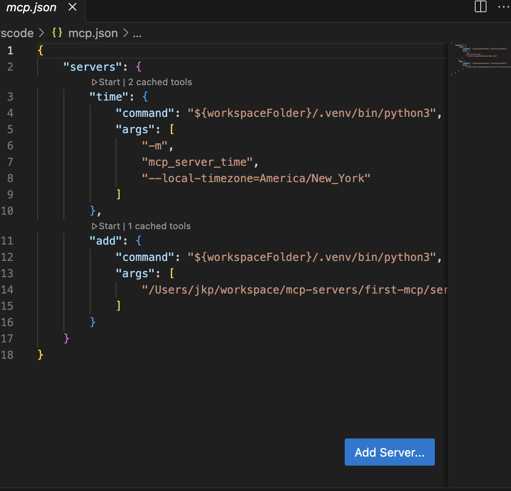
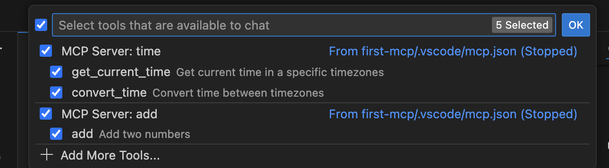
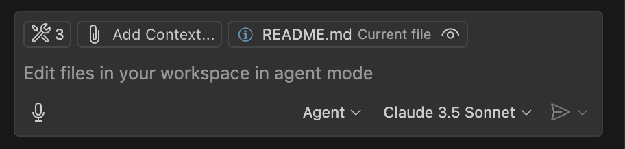
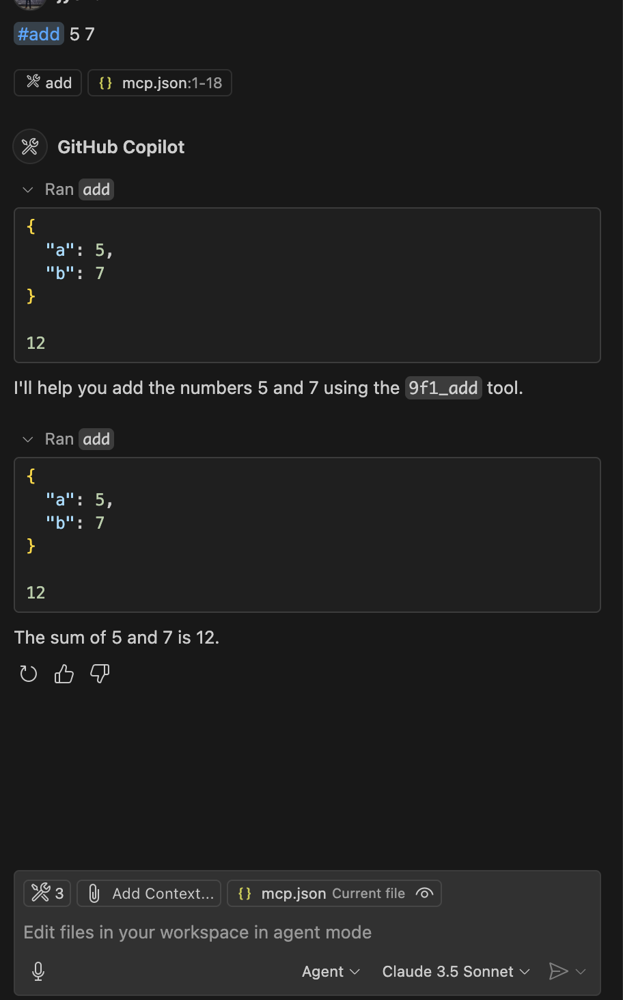
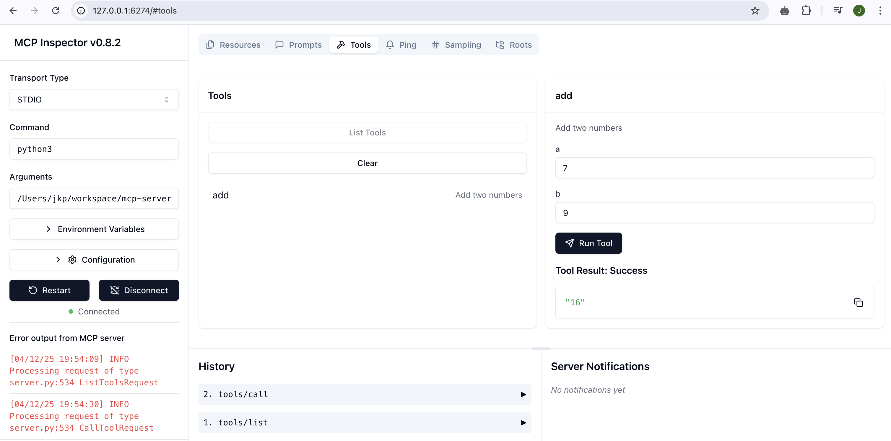

# MCP Demo Server

A simple MCP server demonstrating basic functionality with an addition tool and time server integration.

## Prerequisites

- Python 3.x
- pip (Python package installer)
- VS Code with MCP extension

## Installation

1. Clone the repository:
```sh
git clone <repository-url>
cd first-mcp
```

2. Create and activate a virtual environment:
```sh
# Create virtual environment
python3 -m venv .venv

# Activate virtual environment
## On Windows
.venv\Scripts\activate
## On macOS/Linux
source .venv/bin/activate
```

3. Install dependencies:
```sh
pip install mcp-python fastmcp mcp-server-time
```

## Running the MCP Servers

The project includes two configured servers in `.vscode/mcp.json`:

1. Time Server:
   - Provides time-related functionality
   - Configured for America/New_York timezone
   - Runs using the `mcp_server_time` module

2. Addition Server:
   - Simple addition tool
   - Runs the local `server.py` implementation
   - Provides an `add` function that takes two integers

### Running via VS Code

1. Open the project in VS Code
2. Install the MCP extension
3. Use the MCP Servers view to start/stop servers
4. Monitor server status in the VS Code status bar


## Development

The project includes VS Code configurations for:
- Python path configuration
- Code linting with pylint
- Automatic code formatting on save
- Debug configuration for the MCP server

## Development Options

### MCP Server Configuration
The `.vscode/mcp.json` file supports various configuration options:

```jsonc
{
    "servers": {
        "serverName": {
            "command": "${workspaceFolder}/.venv/bin/python3",
            "args": ["server.py"],
            "env": {
                "DEBUG": "1"
            },
            "cwd": "${workspaceFolder}",
            "shutdownTimeout": 5000,
            "startupTimeout": 10000,
            "restartPolicy": "onCrash"
        }
    }
}
```

### Key Configuration Options

1. **Protocol Settings**
   - `command`: Server executable path
   - `args`: Command line arguments
   - `env`: Environment variables
   - `cwd`: Working directory

2. **Server Behavior**
   - `shutdownTimeout`: Milliseconds to wait for shutdown
   - `startupTimeout`: Milliseconds to wait for startup
   - `restartPolicy`: Server restart behavior (`never`, `always`, `onCrash`)

### Visual References


*MCP Servers panel in VS Code*



*MCP Servers search in VS Code*



*MCP Servers agent mdoe in in VS Code*

## MCP input and output

*MCP Servers agent mode in in VS Code*


### Development Workflow

1. **Server Testing**
```bash
mcp dev server.py¨
```


*MCP commands in VS Code Command Palette*


2. **Debugging**
   - Set breakpoints in VS Code
   - Use the Debug view (⇧⌘D)
   - Select "Debug MCP Server" configuration

3. **Monitoring**
   - Check server status in VS Code status bar
   - View logs in Output panel (MCP Servers channel)
   - Use `#help` command to list available tools

## Available Tools

1. Time Server:
   - Provides time functions with New York timezone support

2. Addition Server:
   - `add`: Takes two integers and returns their sum